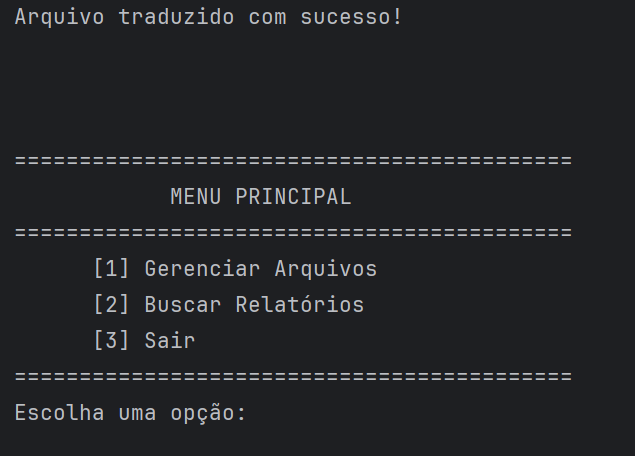

# Finança Pessoal

## Descrição
Este projeto tem por finalidade a criação de um programa em Java que simula algumas funcionalidades de um app de finanças pessoal.
O objetivo é utilizar a manipulação de Streams em arquivos e aplicar funções de programação funcional como map, filter e reduce
para realizar diversos tipos de processamento nesses dados.

## Tecnologias Utilizadas

- *Java SDK 22*: Linguagem de programação utilizada para o desenvolvimento.
- *IDE* IntelliJ
- *Maven*: Gerenciamento de dependências.

## Como Usar

Para utilizar este projeto, clone o repositório e execute a aplicação em seu ambiente de desenvolvimento preferido.

## Como Executar o Projeto

1. *Clone o repositório*:
   bash
   git clone git@github.com:marinagv95/Financa_Pessoal.git
2. **Navegue até o diretório do projeto:**
   bash
   cd financa-pessoal

3. *Abra o projeto na sua IDE (IntelliJ IDEA).*
4. *Compile e execute a aplicação.*

## Funcionalidades

- Adição e remoção de movimentações financeiras.
- Geração de relatórios de despesas e receitas.
- Aplicação de filtros para visualização personalizada de dados.
- Leitura de relatorios em formato CSV.
- Exportação de relatórios em formato TXT.

## Interfaces interativas

### Menu Principal



### Menu de Gerenciamentos


### Adição e Remoção de Relatórios


### Menu de Relatórios


### Saídas dos relatórios

### Movimentacoes Recorrentes


### Movimentacoes Recorrentes


### Movimentacoes Recorrentes


## Estrutura do Projeto
```bash
financa-pessoal/
├── src/
│   ├── main/
│   │   ├── java/
│   │   │	├── example/
│   │   │   │	├── model/            # Modelos de dados (Movimentação financeira, Categoria)
│   │   │   ├── service/              # Serviços para processamento e análise de dados
│   │   │   ├── translator/           # Tradução de dados para visualizações
│   │   │   ├── util/                 # Utilitários e exceções personalizadas
│   │   ├── resources/                # Arquivos de configuração e propriedades
```


## Alunos

<a href="https://github.com/allanaavila">
    
</a>

<a href="https://github.com/dev-luizotavio">
    
</a>

<a href="https://github.com/toscanomatheus">
    
</a>

<a href="https://github.com/marinagv95">
    

